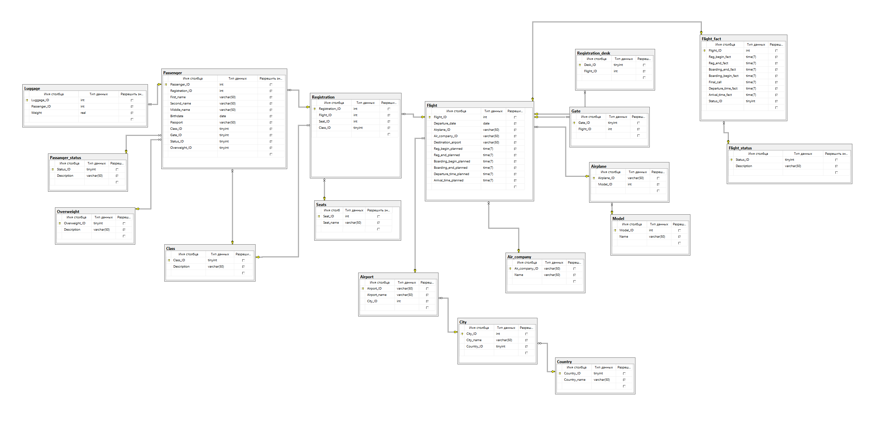
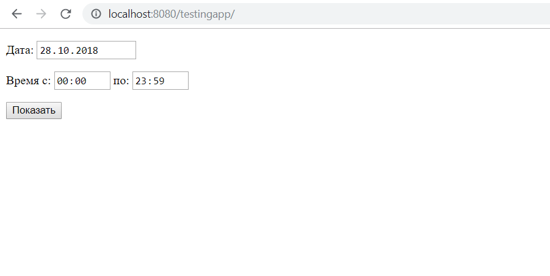
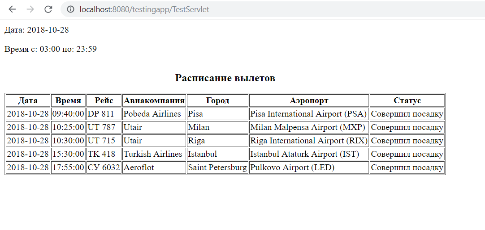

# DB_course
Репозиторий для курса по базам данных от кафедры МОУ МФТИ с
использованием MS SQL Server.  
[🔐 Страница курса 🛠](http://bdis.umeta.ru/)

## Лабораторные работы
16 вариант — Аэропорт  
[Краткое описание некоторых лаб](http://bdis.umeta.ru/db/db_course/labs/tasks/v16.htm)  

  
Схема спроектированной в результате базы

  

  

- [1 лаба](https://github.com/r-vvch/DB_course/tree/master/1_lab) — запросы в базу данных
- [2 лаба](https://github.com/r-vvch/DB_course/tree/master/2_lab) — проектирование базы данных
- [3 лаба](https://github.com/r-vvch/DB_course/tree/master/3_lab) — создание базы данных 
- [5 лаба](https://github.com/r-vvch/DB_course/tree/master/5_lab) — создание и использование представлений
- [6 лаба](https://github.com/r-vvch/DB_course/tree/master/6_lab) — управление транзакциями
- [8 лаба](https://github.com/r-vvch/DB_course/tree/master/8_lab) — выборка метаданных
- [10 лаба](https://github.com/r-vvch/DB_course/tree/master/10_lab) — использование индексов и средств оптимизации запросов

[Доп](https://github.com/r-vvch/DB_course/tree/master/dop) — подключение SQL к Java и создание веб-приложения на Tomcat с выводом расписания вылетов

  
Пример запроса и вывода

  

    
    
  

  

  
